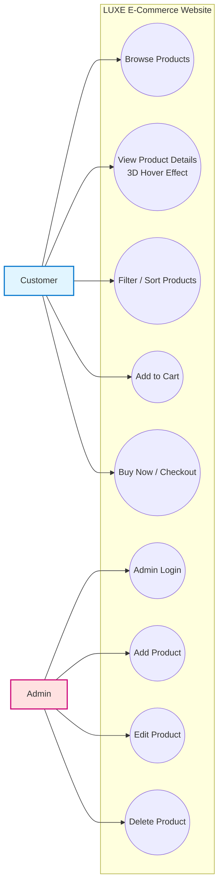
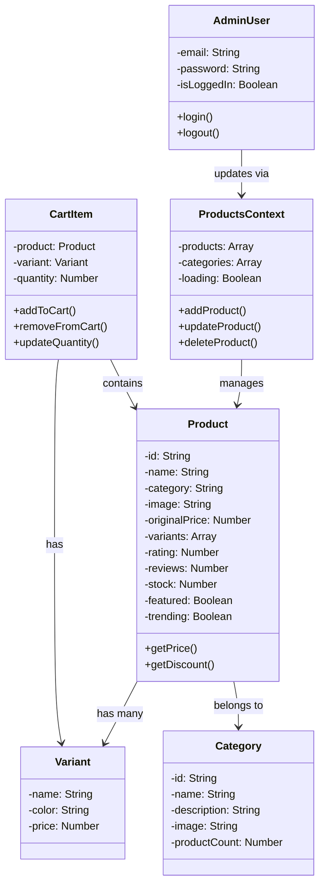
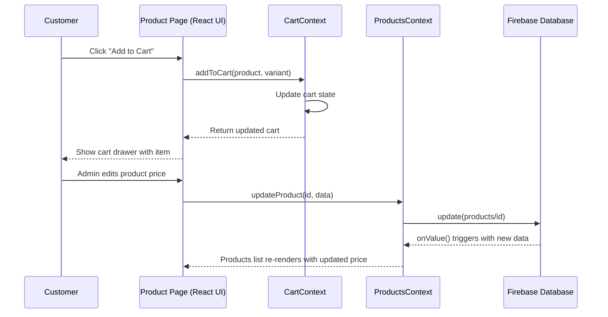
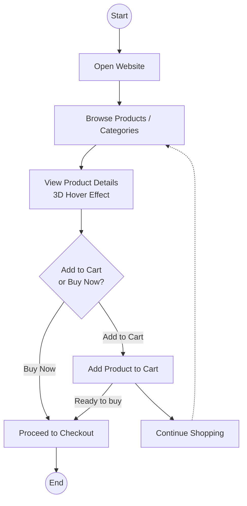

# LUXE 3D E-Commerce Website - UML Diagrams

## Project Overview
This document contains the UML diagrams for the LUXE e-commerce project — a React-based online store with a 3D hover effect on product images, a Firebase Realtime Database backend, and a Firebase-Authenticated Admin Dashboard for managing products.

---

## 1. Use Case Diagram

### Actors
- **Customer**: Browses and shops on the website (no login required)
- **Admin**: Logs in to manage products through the Admin Dashboard

### Customer Use Cases
- Browse Products
- View Product Details (3D Hover Effect)
- Filter / Sort Products
- Add to Cart
- Buy Now / Checkout

### Admin Use Cases
- Admin Login
- Add Product
- Edit Product
- Delete Product

---

## 2. Class Diagram

### Core Classes

#### Product
- `id`: String
- `name`: String
- `category`: String
- `image`: String
- `originalPrice`: Number
- `variants`: Array
- `rating`: Number
- `reviews`: Number
- `stock`: Number
- `featured`: Boolean
- `trending`: Boolean

#### Variant
- `name`: String
- `color`: String
- `price`: Number

#### CartItem
- `product`: Product
- `variant`: Variant
- `quantity`: Number

#### Category
- `id`: String
- `name`: String
- `description`: String
- `image`: String
- `productCount`: Number

#### AdminUser
- `email`: String
- `password`: String
- `isLoggedIn`: Boolean

#### ProductsContext
- `products`: Array
- `categories`: Array
- `loading`: Boolean

---

## 3. Sequence Diagram — Add to Cart & Admin Product Update

### Participants
- **Customer**: End-user on the Product Detail page
- **Product Page (React UI)**: The frontend component
- **CartContext**: Manages the shopping cart state
- **ProductsContext**: Manages product data and connects to Firebase
- **Firebase Database**: Realtime Database storing all products

### Flow Description

**Add to Cart:**
1. Customer clicks "Add to Cart"
2. Product Page calls `addToCart(product, variant)`
3. CartContext updates the cart state
4. CartContext returns the updated cart
5. Product Page shows the cart drawer with the item

**Admin Updates a Product:**
1. Admin edits a product's price on the Admin Dashboard
2. Product Page calls `updateProduct(id, data)`
3. ProductsContext calls Firebase `update(products/id)`
4. Firebase triggers `onValue()` with the new data
5. ProductsContext re-renders the product list with the updated price everywhere on the site

---

## 4. Activity Diagram — Shopping Flow

### Flow Description
1. Customer opens the website
2. Browses products / categories
3. Views product details (with 3D hover effect)
4. Decides to add to cart or buy now
5. If added to cart, can continue shopping or proceed to checkout
6. If buy now, goes straight to checkout

---

## Technical Notes

### 3D Hover Effect
- Implemented using React state (`useState`) and mouse-move event tracking
- The product image rotates on the X and Y axis (`rotateX`, `rotateY`) based on cursor position, using CSS `transform` and `perspective`
- No external 3D model files are used — the effect is achieved purely with CSS 3D transforms

### Data Storage
- Product data is stored in Firebase Realtime Database under the `products` node
- Each product is read in real time using `onValue()`, so any Admin change reflects instantly on the customer-facing site

### Authentication
- Admin login uses Firebase Authentication (Email/Password)
- Protected routing (`ProtectedRoute.jsx`) ensures the Admin Dashboard is only accessible after login

---

## Conclusion

These UML diagrams describe the actual structure and behaviour of the LUXE e-commerce project:

- **Functional requirements** through the Use Case Diagram
- **Static structure** through the Class Diagram
- **Dynamic behaviour** through the Sequence Diagram
- **Process flow** through the Activity Diagram

The system focuses on a modern customer shopping experience with a 3D hover effect and a simple, secure Admin panel for real-time product management.