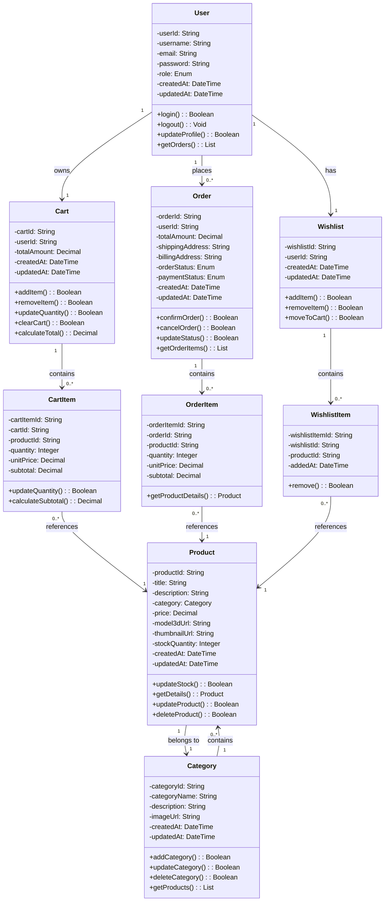
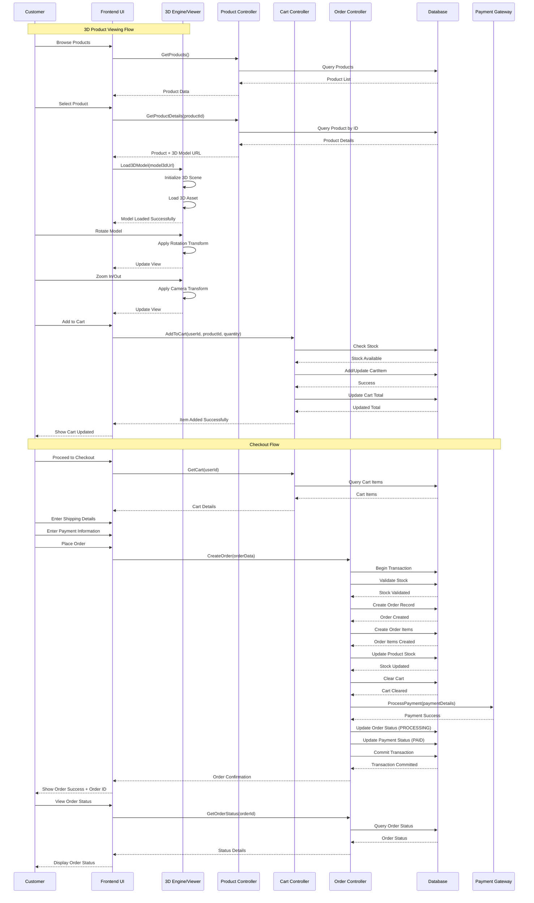

# 3D E-Commerce Store - UML Diagrams

## Project Overview
This document contains comprehensive UML diagrams for a multi-category premium 3D E-Commerce Store web application featuring interactive 3D models, category filters, a 3D product viewer, shopping cart, and checkout features.

---

## 1. Use Case Diagram

### Actors
- **Customer**: End-user who browses and purchases products
- **Admin**: System administrator who manages products and orders

### Customer Use Cases
- Browse 3D Products
- Interact/Rotate 3D Models
- Filter by Category
- Add to Cart
- Add to Wishlist
- View Cart
- Checkout
- View Order Status

### Admin Use Cases
- Manage Products (Add/Update/Delete)
- Manage Categories (Add/Update/Delete)
- View Customer Orders

```mermaid
graph TD
    Actor_Customer["Actor: Customer"]
    Actor_Admin["Actor: Admin"]
    
    UC1["(Browse 3D Products)"]
    UC2["(Interact/Rotate 3D Models)"]
    UC3["(Filter by Category)"]
    UC4["(Add to Cart)"]
    UC5["(Add to Wishlist)"]
    UC6["(View Cart)"]
    UC7["(Checkout)"]
    UC8["(View Order Status)"]
    UC9["(Manage Products)"]
    UC10["(Manage Categories)"]
    UC11["(View Customer Orders)"]
    UC12["(Add Product)"]
    UC13["(Update Product)"]
    UC14["(Delete Product)"]
    UC15["(Add Category)"]
    UC16["(Update Category)"]
    UC17["(Delete Category)"]
    
    Actor_Customer --> UC1
    Actor_Customer --> UC2
    Actor_Customer --> UC3
    Actor_Customer --> UC4
    Actor_Customer --> UC5
    Actor_Customer --> UC6
    Actor_Customer --> UC7
    Actor_Customer --> UC8
    
    Actor_Admin --> UC9
    Actor_Admin --> UC10
    Actor_Admin --> UC11
    
    UC12 -.-> UC9
    UC13 -.-> UC9
    UC14 -.-> UC9
    UC15 -.-> UC10
    UC16 -.-> UC10
    UC17 -.-> UC10
    
    UC4 -.-> UC1
    UC5 -.-> UC1
    UC7 -.-> UC6
    
    style Actor_Customer fill:#e1f5ff,stroke:#0177cd,stroke-width:2px
    style Actor_Admin fill:#ffe1e1,stroke:#cd0177,stroke-width:2px
    style UC1 fill:#f0f0f0,stroke:#333,stroke-width:1px
    style UC2 fill:#f0f0f0,stroke:#333,stroke-width:1px
    style UC3 fill:#f0f0f0,stroke:#333,stroke-width:1px
    style UC4 fill:#f0f0f0,stroke:#333,stroke-width:1px
    style UC5 fill:#f0f0f0,stroke:#333,stroke-width:1px
    style UC6 fill:#f0f0f0,stroke:#333,stroke-width:1px
    style UC7 fill:#f0f0f0,stroke:#333,stroke-width:1px
    style UC8 fill:#f0f0f0,stroke:#333,stroke-width:1px
    style UC9 fill:#fff0e1,stroke:#cd7701,stroke-width:1px
    style UC10 fill:#fff0e1,stroke:#cd7701,stroke-width:1px
    style UC11 fill:#fff0e1,stroke:#cd7701,stroke-width:1px
```

### Use Case Relationships
- **Include relationships**: Manage Products includes Add/Update/Delete Product; Manage Categories includes Add/Update/Delete Category
- **Extend relationships**: Add to Cart and Add to Wishlist extend Browse 3D Products; Checkout extends View Cart

---

## 2. Class Diagram

### Core Classes and Attributes

#### User Class
Represents system users (customers and administrators)
- `userId`: String - Unique user identifier
- `username`: String - User's username
- `email`: String - User's email address
- `password`: String - Encrypted password
- `role`: Enum (CUSTOMER, ADMIN) - User role
- `createdAt`: DateTime - Account creation timestamp
- `updatedAt`: DateTime - Last update timestamp

#### Category Class
Represents product categories (luxury watches, tech devices, etc.)
- `categoryId`: String - Unique category identifier
- `categoryName`: String - Category name
- `description`: String - Category description
- `imageUrl`: String - Category image URL
- `createdAt`: DateTime - Creation timestamp
- `updatedAt`: DateTime - Last update timestamp

#### Product Class
Represents 3D products with associated models
- `productId`: String - Unique product identifier
- `title`: String - Product title
- `description`: String - Product description
- `category`: Category - Associated category
- `price`: Decimal - Product price
- `model3dUrl`: String - URL to 3D model file
- `thumbnailUrl`: String - Product thumbnail image
- `stockQuantity`: Integer - Available stock
- `createdAt`: DateTime - Creation timestamp
- `updatedAt`: DateTime - Last update timestamp

#### Cart Class
Represents user's shopping cart
- `cartId`: String - Unique cart identifier
- `userId`: String - Associated user ID
- `totalAmount`: Decimal - Cart total amount
- `createdAt`: DateTime - Creation timestamp
- `updatedAt`: DateTime - Last update timestamp

#### CartItem Class
Represents individual items in shopping cart
- `cartItemId`: String - Unique cart item identifier
- `cartId`: String - Associated cart ID
- `productId`: String - Associated product ID
- `quantity`: Integer - Item quantity
- `unitPrice`: Decimal - Price per unit
- `subtotal`: Decimal - Item subtotal

#### Order Class
Represents customer orders
- `orderId`: String - Unique order identifier
- `userId`: String - Associated user ID
- `totalAmount`: Decimal - Order total amount
- `shippingAddress`: String - Shipping address
- `billingAddress`: String - Billing address
- `orderStatus`: Enum (PENDING, PROCESSING, SHIPPED, DELIVERED, CANCELLED) - Order status
- `paymentStatus`: Enum (PENDING, PAID, FAILED, REFUNDED) - Payment status
- `createdAt`: DateTime - Creation timestamp
- `updatedAt`: DateTime - Last update timestamp

#### OrderItem Class
Represents individual items in an order
- `orderItemId`: String - Unique order item identifier
- `orderId`: String - Associated order ID
- `productId`: String - Associated product ID
- `quantity`: Integer - Item quantity
- `unitPrice`: Decimal - Price per unit
- `subtotal`: Decimal - Item subtotal

#### Wishlist Class
Represents user's wishlist
- `wishlistId`: String - Unique wishlist identifier
- `userId`: String - Associated user ID
- `createdAt`: DateTime - Creation timestamp
- `updatedAt`: DateTime - Last update timestamp

#### WishlistItem Class
Represents items in wishlist
- `wishlistItemId`: String - Unique wishlist item identifier
- `wishlistId`: String - Associated wishlist ID
- `productId`: String - Associated product ID
- `addedAt`: DateTime - Date added to wishlist

### Class Relationships Summary

| Relationship | Type | Description |
|--------------|------|-------------|
| User → Order | One-to-Many | A user can place multiple orders |
| User → Cart | One-to-One | Each user has one shopping cart |
| User → Wishlist | One-to-One | Each user has one wishlist |
| Category → Product | One-to-Many | A category contains multiple products |
| Cart → CartItem | One-to-Many | A cart contains multiple items |
| Order → OrderItem | One-to-Many | An order contains multiple order items |
| Product → CartItem | Many-to-One | Products can be in multiple carts |
| Product → OrderItem | Many-to-One | Products can be in multiple orders |

---

## 3. Sequence Diagram (Checkout & 3D Interaction Flow)

### Participants
- **Customer**: End-user interacting with the system
- **Frontend UI**: User interface for customer interactions
- **3D Engine/Viewer**: Component responsible for rendering 3D models
- **Product Controller**: Backend controller for product operations
- **Cart Controller**: Backend controller for cart operations
- **Order Controller**: Backend controller for order operations
- **Database**: Data persistence layer
- **Payment Gateway**: External payment processing service

### Flow Description

#### Phase 1: 3D Product Viewing
1. Customer browses products through the Frontend UI
2. Frontend UI requests product list from Product Controller
3. Product Controller queries database and returns product data
4. Customer selects a specific product
5. Frontend UI requests detailed product information including 3D model URL
6. 3D Engine loads and initializes the 3D model
7. Customer interacts with the model (rotate, zoom)
8. 3D Engine applies transformations and updates the view

#### Phase 2: Add to Cart
1. Customer adds product to cart
2. Cart Controller validates stock availability
3. Cart Controller updates cart items and recalculates total
4. Frontend UI displays cart update confirmation

#### Phase 3: Checkout Process
1. Customer proceeds to checkout
2. Cart Controller retrieves current cart contents
3. Customer enters shipping and payment details
4. Order Controller initiates database transaction
5. Order Controller validates stock and creates order record
6. Order Controller updates product stock and clears cart
7. Payment Gateway processes payment
8. Order Controller updates order and payment status
9. Database transaction is committed
10. Customer receives order confirmation

#### Phase 4: Order Status Tracking
1. Customer requests order status
2. Order Controller retrieves current status from database
3. Frontend UI displays order status to customer

### Key Sequence Flow Highlights

1. **3D Model Loading**: The 3D Engine handles model initialization and rendering independently, allowing smooth user interactions
2. **Stock Validation**: Stock is validated both when adding to cart and during checkout to prevent overselling
3. **Transaction Management**: Database transactions ensure data consistency during order creation
4. **Payment Integration**: External payment gateway is integrated with proper status tracking
5. **Cart Management**: Cart is automatically cleared after successful order completion

---

## Technical Notes

### 3D Model Integration
- 3D models are loaded asynchronously to maintain UI responsiveness
- Model URLs are stored as external references to optimize database performance
- The 3D Engine supports standard transformations (rotation, zoom, pan)

### Data Consistency
- Database transactions ensure atomic operations during order creation
- Stock validation prevents overselling
- Cart operations are atomic with automatic total recalculation

### Security Considerations
- User passwords are encrypted before storage
- Payment information is processed through secure payment gateways
- Role-based access control separates customer and admin functions

### Scalability
- Cart and wishlist data is user-specific for easy horizontal scaling
- 3D model assets are served through CDN for optimal performance
- Database indexing on frequently queried fields (userId, productId, orderId)

---

## Conclusion

These UML diagrams provide a comprehensive architectural view of the 3D E-Commerce Store system, covering:

- **Functional requirements** through the Use Case Diagram
- **Static structure** through the Class Diagram  
- **Dynamic behavior** through the Sequence Diagram

The system is designed to handle interactive 3D product viewing while maintaining robust e-commerce functionality including cart management, order processing, and payment integration.
